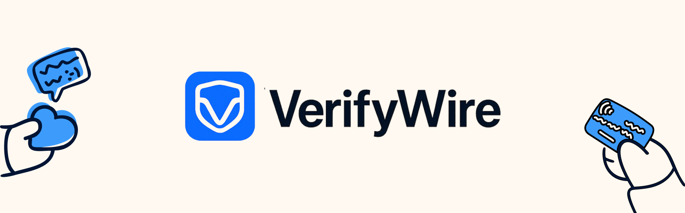

# VerifyWire



> **Trust, but verify.** Instant payment instruction validation against bank-attested rails on blockchain.

[](https://dorahacks.io/hackathon/domainfi-challenge/detail)


VerifyWire eliminates payment fraud by letting banks publish their official payment rails as cryptographic hashes on the Doma blockchain. When payers receive payment instructions, they can instantly verify them against these bank-attested records, getting clear ✅/🟡/🔴 results.

## 🎯 Who It Helps & Why It Matters

**Target Users:** SMB finance teams, agencies, property managers — anyone wiring money to vendors.

**The Problem:** Business Email Compromise is the #1 payments scam, with U.S. losses hitting **$16.6B in 2024** per FBI/IC3 reporting. Every year, thousands of businesses fall victim to fraudulent payment instructions that appear legitimate but lead to scammers' accounts.

**The Solution:** VerifyWire provides **mathematical certainty** about payment instructions before you send money. No more guesswork, no more costly mistakes, no more BEC scams.

> **"Business Email Compromise losses reached a record $16.6 billion in 2024"** - [Washington Post](https://www.washingtonpost.com/business/2025/05/16/166-billion-scam-losses-new-record/?utm_source=chatgpt.com)

## 🚀 Quick Start

### For Banks
1. **Connect Wallet** → Connect your MetaMask to Doma Testnet
2. **Claim Your Bank** → Register your institution
3. **Add Payment Rails** → Publish ACH, Wire, and International routing details
4. **Go Live** → Your payment rails are now verifiable on-chain

### For Payers
1. **Paste Instructions** → Copy payment details from your bank/remittance
2. **Get Instant Results** → See if they match bank-attested rails
3. **Pay with Confidence** → Green checkmark = verified, safe to proceed

## ✨ Key Features

- **🔐 Privacy-First**: Only cryptographic hashes stored on-chain, never plaintext account numbers
- **⚡ Instant Verification**: Real-time validation against live blockchain data
- **🏦 Bank-Grade Security**: Built on Doma's enterprise blockchain infrastructure
- **🎯 Zero-Trust Architecture**: Mathematical verification eliminates intermediaries
- **📱 Web3 Native**: MetaMask integration for seamless wallet experience
- **🔒 PII Protection**: Automated scanning prevents accidental exposure of personal data

## 🏗️ Architecture

```
Frontend (HTML/CSS/JS) → Smart Contract (Solidity) → Doma Testnet
     ↓                        ↓                        ↓
   User Interface      VerifyWireRegistry       On-Chain Storage
   MetaMask Integration    Hash Verification     Immutable Records
   Real-time Validation    Gas-Optimized         Event Logging
```

**Tech Stack:**
- **Frontend**: Vanilla JavaScript, HTML5, CSS3, Local Storage
- **Blockchain**: Solidity, Foundry, Doma Testnet
- **Web3**: Ethers.js v6, MetaMask, WalletConnect
- **Security**: keccak256 hashing, ECDSA signatures, PII protection
- **Development**: Python HTTP Server, Git hooks, Pre-commit validation

## 📋 Prerequisites

- [MetaMask](https://metamask.io) browser extension
- Test tokens from our [Testnet Tokens Guide](./testnet-tokens.html)
- Python 3.x for local development server
- Modern web browser with JavaScript enabled

## 🛠️ Local Development

```bash
# Navigate to project directory
cd verifywire

# Start local development server
python3 -m http.server 8080

# Open your browser to http://localhost:8080
```

**Note:** The application is already configured and ready to run locally with all dependencies included.

## 📚 Documentation

- [Architecture Overview](./docs/ARCHITECTURE.md)
- [Smart Contract Details](./docs/CONTRACTS.md)
- [Data Normalization](./docs/NORMALIZATION.md)
- [Secure Deployment](./onchain/SECURE_DEPLOY.md)

## 🎯 Mission

VerifyWire is building the foundation for **trustless payment verification** in Web3. By anchoring bank payment rails to blockchain, we create an immutable, transparent system that protects both financial institutions and their customers from fraud and errors.

## 🏆 DomaFi Challenge Hackathon

This project was built for the [DomaFi Challenge Hackathon](https://dorahacks.io/hackathon/domainfi-challenge/detail), showcasing how Doma's high-performance blockchain can power real-world DeFi and Web3 applications. Special thanks to the Doma team for creating an incredible platform that makes building secure, scalable blockchain applications accessible to developers worldwide.

## 📄 License

This project is licensed under the MIT License - see the LICENSE file for details.

## 🌟 Acknowledgments

- **Doma Team** - For the incredible blockchain infrastructure
- **Foundry** - For the excellent smart contract development toolkit
- **MetaMask** - For the seamless Web3 wallet experience

---

**Built with ❤️ for the future of trustless finance**

*VerifyWire - Because every payment deserves verification.*